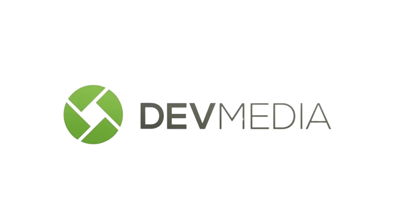

# DevMedia Projetos 👇

   

    
   

Aqui armazeno meus projetos desenvolvidos a partir dos estudos na plataforma DevMedia, documentando meu progresso na carreira de Front-End.

> ℹ️ Meu repositório está em constante atualização, refletindo meu progresso contínuo e aprendizado na carreira de Front-End. Novos projetos e melhorias são regularmente adicionados, garantindo que o conteúdo esteja sempre atualizado e relevante.

 ## Tecnologias abordadas              
   
  - HTML                                      
  - CSS
  - Algoritmo
  - JavaScript
  - React
  - API

## Projeto recentes

- <a href="https://github.com/SergioSinhoca/projetos-devMedia/tree/master/projetos-react/projeto-sorveteria"
 title="View repository"> Projeto Gelateria </a>

## Atalho
- `iniciando`
    - Esta pasta contém o início dos meus estudos em HTML e CSS.
- `codigos-js`
    - Esta pasta contém exercícios e projetos realizados em JavaScript.
- `projetos-react`
   - Esta pasta contém projetos utilizando a biblioteca React.

## Siga-me 🧑‍💻

 <a href="https://www.devmedia.com.br/perfil/sergio-luiz-sinhoca-1"
 title="View profile">Perfil no DevMedia </a>

 <a href="https://br.linkedin.com/in/sergio-luiz-sinhoca?original_referer=https%3A%2F%2Fwww.google.com%2F"
 title="View profile">Linkedin</a>

    
  
  
  
