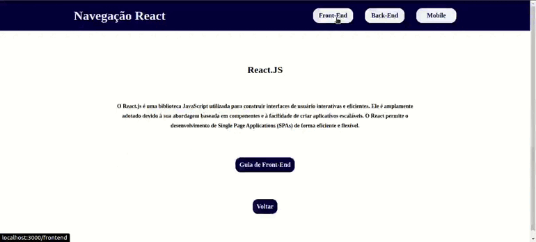

## <h1 align="center"> Informação do projeto 🧑‍💻 </h1>
Nesse exercício o objetivo é utilizar o SPA do React para navegar entre paginas.
## Tecnologias utilizadas 📚

## Exemplo do exercício
 

    
 
